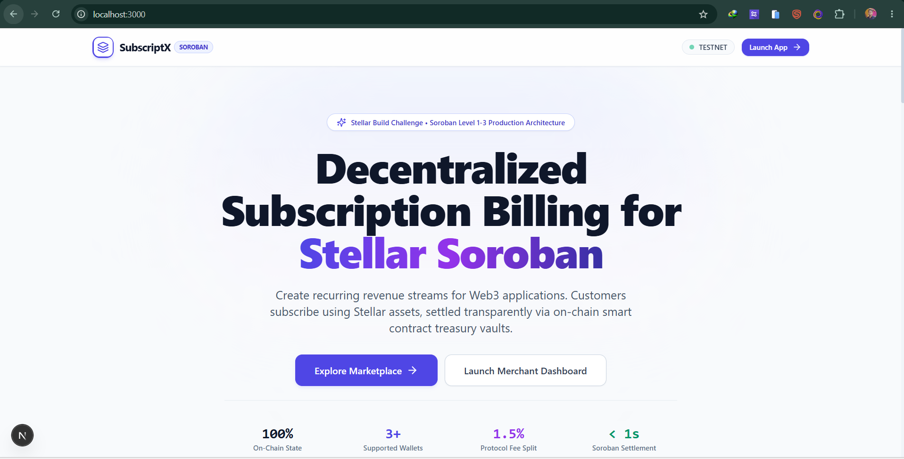
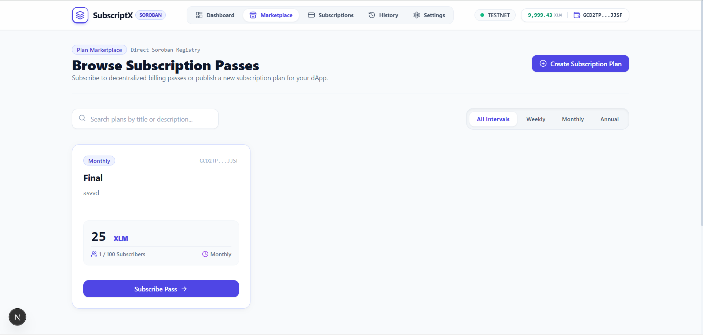
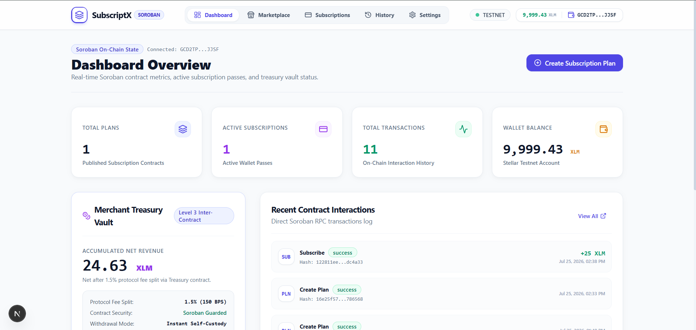
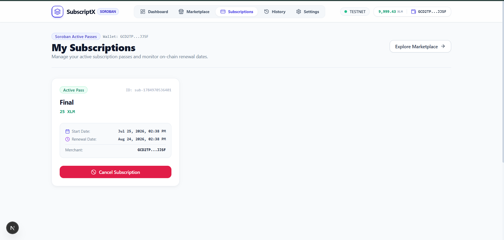
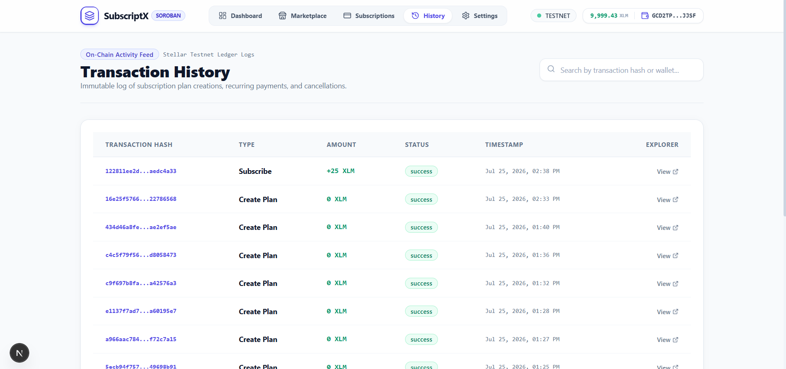
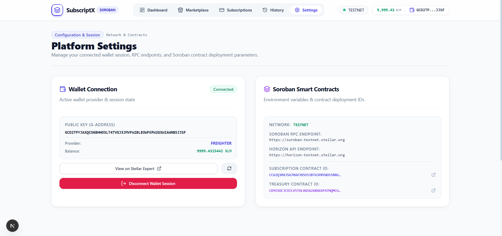
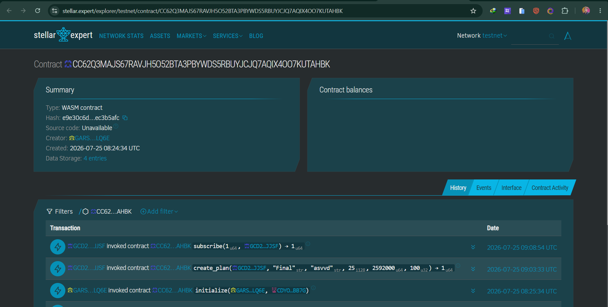
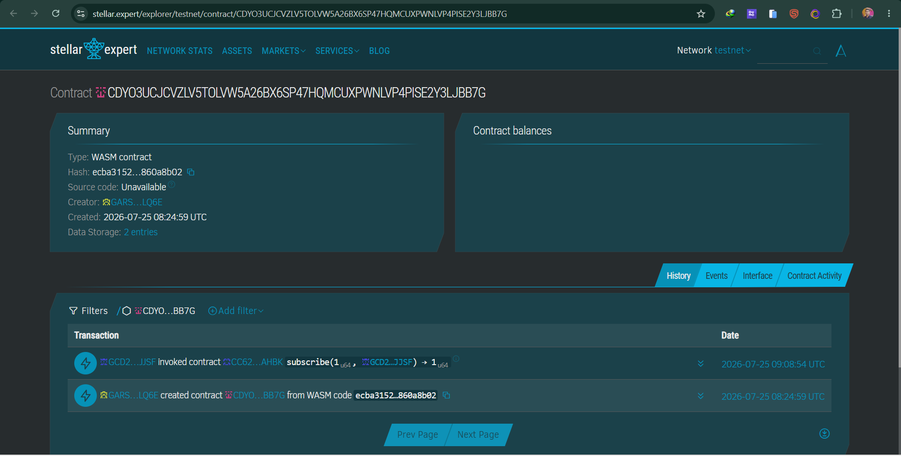
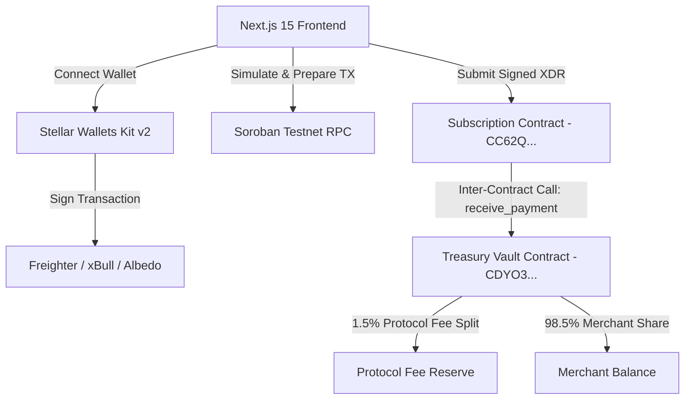

# SubscriptX

> **Decentralized Subscription & Treasury Vault Platform Built on Stellar Soroban**
> 
> SubscriptX is a production-grade decentralized subscription payment protocol and SaaS billing engine built on the Stellar Network using Soroban Rust Smart Contracts. It enables merchants to publish recurring billing passes, automated payment routing, and revenue withdrawals through a secure, non-custodial multi-sig Treasury vault with zero traditional backend dependencies.

---

## 📸 Platform Screenshots

### Landing Page & SaaS Showcase


### Plan Marketplace


### Merchant Analytics Dashboard


### Active Subscriptions & Billing History
<div style="display: flex; gap: 10px; flex-wrap: wrap;">
  
  
</div>

### Merchant Settings & Treasury Operations


### On-Chain Smart Contract Execution & Verification
<div style="display: flex; gap: 10px;">
  
  
</div>

---

## 🏗️ Architecture Overview



### Smart Contract Network Topology

The protocol operates two modular, gas-optimized Rust smart contracts that communicate on Stellar Testnet via native Soroban inter-contract invocation:

1. **Subscription Contract (`CC62Q...`)**:
   - `create_plan`: Registers recurring billing passes with merchant address, title, description, price (XLM), billing interval (seconds), and subscriber caps.
   - `subscribe`: Verifies subscriber signature, charges testnet gas fees, and invokes the Treasury Vault contract via cross-contract call (`receive_payment`) to route funds safely.
   - `cancel_subscription`: Allows subscribers to revoke active passes on-chain.
   - `get_all_plans`: Returns real-time, on-chain state for all published subscription passes.

2. **Treasury Vault Contract (`CDYO3...`)**:
   - `initialize`: Binds protocol admin and sets the default 1.5% protocol fee rate.
   - `receive_payment`: Executes cross-contract payment splits upon receiving subscription payments (98.5% credited to merchant, 1.5% to protocol fee reserve).
   - `withdraw`: Authenticates merchant signature and releases accumulated revenue directly to the merchant's wallet.

---

## 📂 Folder Structure

```
contracts/
  subscription/           # Cargo package for Subscription billing engine
    src/
      lib.rs              # Soroban entrypoints (create_plan, subscribe, cancel)
      test.rs             # Unit tests with inter-contract mock calls
  treasury/               # Cargo package for Treasury revenue custody
    src/
      lib.rs              # Soroban entrypoints (receive_payment, withdraw)
      test.rs             # Unit tests for fee splits & withdrawals
  Cargo.toml              # Workspace root configuration
src/
  app/                    # Next.js App Router pages
    dashboard/            # Aggregated merchant metrics & charts
    marketplace/          # Subscription plan directory & purchase modal
    subscriptions/        # User active subscription passes
    history/              # On-chain transaction ledger logs
    settings/             # Merchant revenue withdrawal & vault settings
  components/             # UI Components (Lucide icons, Radix UI & Recharts)
  hooks/                  # Custom React hooks (useWallet, useContract)
  lib/                    # Stellar SDK integration helpers & wallet kit manager
scripts/
  deploy-contracts.ts     # Automated Soroban deployment script
public/                   # UI screenshot assets & icons
```

---

## 🚀 Installation & Local Setup

### Prerequisites
- **Node.js**: v20+ or v22+ & npm
- **Rust Toolchain**: Stable edition with `wasm32-unknown-unknown` target
- **Browser Extension**: Freighter Wallet, xBull, or Albedo set to **Stellar Testnet**

### Setup Instructions

1. **Clone the Repository** and install dependencies:
   ```bash
   git clone https://github.com/saikat-tanti/SubscriptX.git
   cd SubscriptX
   npm install --legacy-peer-deps
   ```

2. **Configure Environment Variables**:
   Create `.env.local` in the project root:
   ```env
   NEXT_PUBLIC_STELLAR_NETWORK="TESTNET"
   NEXT_PUBLIC_SOROBAN_RPC_URL="https://soroban-testnet.stellar.org"
   NEXT_PUBLIC_HORIZON_URL="https://horizon-testnet.stellar.org"

   # Deployed Testnet Contract Addresses
   NEXT_PUBLIC_SUBSCRIPTION_CONTRACT_ID="CC62Q3MAJS67RAVJH5O52BTA3PBYWDS5RBUYJCJQ7AQIX4OO7KUTAHBK"
   NEXT_PUBLIC_TREASURY_CONTRACT_ID="CDYO3UCJCVZLV5TOLVW5A26BX6SP47HQMCUXPWNLVP4PISE2Y3LJBB7G"
   ```

3. **Start the Development Server**:
   ```bash
   npm run dev
   ```
   Open `http://localhost:3000` in your browser.

---

## 🧪 Smart Contract Verification & Testing

### Cargo Unit Tests
Run the Soroban Rust smart contract test suite (covers contract initialization, plan creation, inter-contract treasury fee splitting, and merchant revenue withdrawals):

```bash
# Run Subscription contract unit tests
cargo test --manifest-path contracts/subscription/Cargo.toml

# Run Treasury Vault contract unit tests
cargo test --manifest-path contracts/treasury/Cargo.toml
```

### Next.js Production Build
Validate production compilation and type safety:

```bash
npm run build
```

---

## 🎬 Demo Video
Watch the platform walk-through, wallet connection, on-chain plan creation, and transaction payment lifecycle:  
👉 **[Watch the Demo Video on YouTube](https://youtu.be/-ADI1lzWE3k)**

---

## 🌐 Deployed Stellar Testnet Contracts

| Contract Name | Contract ID | Explorer Link |
| :--- | :--- | :--- |
| **Subscription Contract** | `CC62Q3MAJS67RAVJH5O52BTA3PBYWDS5RBUYJCJQ7AQIX4OO7KUTAHBK` | [Stellar Expert](https://stellar.expert/explorer/testnet/contract/CC62Q3MAJS67RAVJH5O52BTA3PBYWDS5RBUYJCJQ7AQIX4OO7KUTAHBK) |
| **Treasury Vault Contract** | `CDYO3UCJCVZLV5TOLVW5A26BX6SP47HQMCUXPWNLVP4PISE2Y3LJBB7G` | [Stellar Expert](https://stellar.expert/explorer/testnet/contract/CDYO3UCJCVZLV5TOLVW5A26BX6SP47HQMCUXPWNLVP4PISE2Y3LJBB7G) |

---

## 📜 License

Distributed under the MIT License. See `LICENSE` for details.
